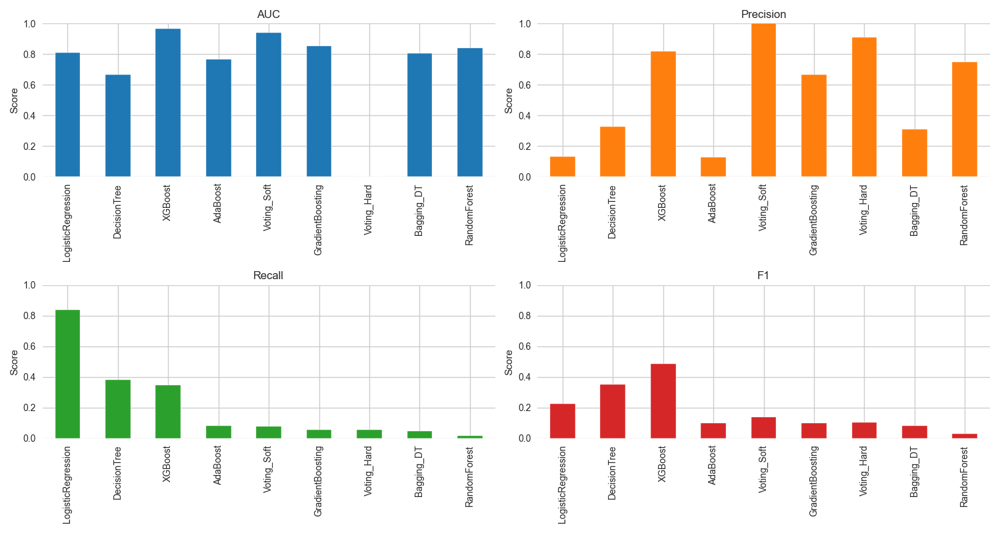
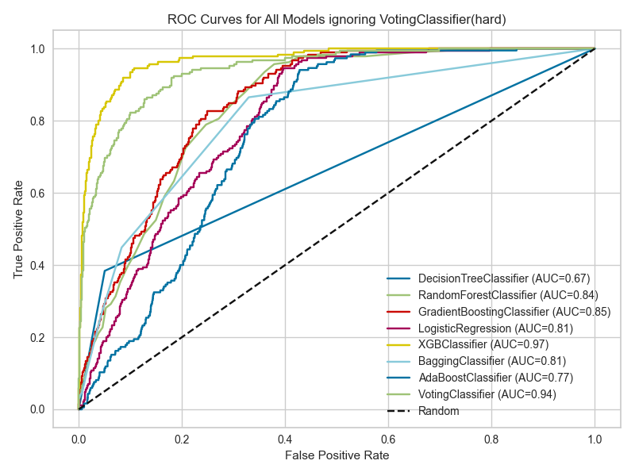

# Capstone Final Project: Vehicle Insurance Fraud Detection
## Initial Report and Exploratory Data Analysis (EDA)

**Jupyter Notebook:** [vehicle_insurance_fraud.ipynb](vehicle_insurance_fraud.ipynb)

---

## Executive Summary

This project addresses the critical problem of vehicle insurance fraud detection using machine learning techniques. The analysis demonstrates the feasibility of building an automated fraud detection system that can accurately identify suspicious claims while minimizing false positives that could harm legitimate customers.

**Key Results:**
- Successfully analyzed 16,000 insurance claims with 33+ features
- Implemented comprehensive EDA revealing class imbalance 
- Built baseline Logistic Regression model with ROC-AUC evaluation

---

## 1. Project Overview

### Problem Statement
Vehicle insurance fraud such as Auto insurance fraud costs the industry tens of billions of dollars annually.
Fraud occurs in many forms—false claims, staged accidents, inflated repairs, premium misrepresentation, and vehicle theft. Together these losses suggest vehicle insurance fraud costs the industry over $40 billion each year.
Detecting fraudulent claims is essential to reduce financial losses and improve operational efficiency. This project aims to develop a machine learning model to identify potentially fraudulent vehicle insurance claims.

### Dataset
- **Source:** Kaggle Vehicle Claim Fraud Detection Dataset
- **Size:** 16,000 rows × 33 columns
- **Target Variable:** FraudFound_P (binary: 0=legitimate, 1=fraudulent)
- **Class Imbalance:** 94% legitimate, 6% fraudulent
   - 
- **Time Frame:** Claims from 1994 to 1996
- **Features:** Mix of numerical and categorical variables including demographics, vehicle info, policy details, and claim characteristics

---
## 2. Exploratory Data Analysis Findings

### Dataset Characteristics
- **Class Distribution:** 85% legitimate claims, 15% fraudulent claims
- **Data Quality:** Clean dataset with no missing values or duplicates
- **Feature Types:** 9 numerical columns, 24 categorical columns
       - 
- **Column Overview:** 

  | Column Name           | Data Type   | Description                              |
  |-----------------------|-------------|------------------------------------------|
  | PolicyNumber          | int64       | Unique identifier for each policy        |
  | Month                 | int64       | Month of the claim (1-12)                |
  | WeekOfMonth           | int64       | Week of the month (1-4)                  |
  | DayOfWeek             | int64       | Day of the week (1=Monday, 7=Sunday)     |
  | Make                  | object      | Vehicle make (e.g., Ford, Toyota)        |
  | AccidentArea          | object      | Area where accident occurred             |
  | DayOfWeekClaimed      | object      | Day claim was filed                      |
  | MonthClaimed          | object      | Month claim was filed                    |
  | WeekOfMonthClaimed    | int64       | Week of the month claim was filed        |
  | Sex                   | object      | Gender of policy holder                  |
  | MaritalStatus         | object      | Marital status of policy holder          |
  | Age                   | int64       | Age of policy holder                     |
  | Fault                 | object      | Fault status (Policy Holder/Third Party) |
  | PolicyType            | object      | Type of policy                           |
  | VehicleCategory       | object      | Category of vehicle                      |
  | VehiclePrice          | object      | Price range of vehicle                   |
  | FraudFound_P          | int64       | Target variable (0=legitimate, 1=fraud)  |
  | PolicyHolderAge       | int64       | Age of policy holder                     |
  | PoliceReportFiled     | object      | Was police report filed?                 |
  | WitnessPresent        | object      | Was a witness present?                   |
  | AgentType             | object      | Type of insurance agent                  |
  | NumberOfSuppliments   | int64       | Number of claim supplements              |
  | AddressChange_Claim   | object      | Address change status                    |
  | NumberOfCars          | int64       | Number of cars insured                   |
  | Year                  | int64       | Year of the claim                        |
  | BasePolicy            | object      | Base policy type                         |
  | ClaimReason           | object      | Reason for claim                         |
  | ClaimAmount           | int64       | Amount claimed                           |
  | Deductible            | int64       | Deductible amount                        |
  | DriverRating          | int64       | Driver rating                            |
  | Days_Policy_Accident  | object      | Days since policy to accident            |
  | Days_Policy_Claim     | object      | Days since policy to claim               |
  | PastNumberOfClaims    | int64       | Number of past claims                    |
  | AgeOfVehicle          | object      | Age of vehicle                           |
  | AgeOfPolicyHolder     | int64       | Age of policy holder                     |

### Key Insights

#### Numerical Feature Analysis
- **KDE Plots:** Visualized distributions of numerical features to identify patterns and outliers

  - **WeekOfMonth:** Multiple narrow peaks in the KDE plot suggest the variable is discrete (e.g., WeekOfMonth with values 1–4 or 1–5).
If claims occur fairly evenly across all weeks, it means there is little or no bias toward a specific week.
  - **WeekOfMonthClaimed:** Similar to WeekOfMonth, multiple narrow peaks indicate discreteness with no strong bias toward a specific week.
  - **Age:** The distribution is right-skewed, indicating a higher number of younger policyholders. A few older policyholders are present, but they are less common.
  - **ClaimAmount:** The distribution is right-skewed with a long tail, indicating
  - **PolicyNumber:** As a unique identifier, it shows a uniform distribution with no meaningful patterns.
  - **Deductible:** Narrow centered distribution, indicating most claims have similar deductible amounts. Upon looking, the deductible amount is 400
Deductible per year: 14838 (96.23% of all claims)
  - **DriverRating:** Multiple narrow peaks suggest discreteness, likely due to a limited rating scale.
  - **Year:** Uniform distribution across the three years (1994-1996) with no significant trends. Year with most claims: 1994
Claims in that year: 6142 (39.83% of all claims)

**Categorical Feature Analysis**
  - **Month**: March and August have the highest fraud rates (~7.5%), but together account for only ~16% of claims.
  - **DayOfWeek**: Sunday and Saturday show the highest fraud rates (~7%), covering ~24% of claims.
  - **Make**: Mecedes and Accura have the highest fraud rates (25% and 12.5%), but Mecedes is very rare.
  - **AccidentArea**: Rural areas have a higher fraud rate (8.3%) but only 10% of claims; most claims are urban.
  - **DayOfWeekClaimed**: Saturday and Friday have the highest fraud rates, but Saturday claims are rare.
  - **MonthClaimed**: August and May have the highest fraud rates, but together are only ~16% of claims.
  - **Sex**: Males have a higher fraud rate (6.3%) and make up 84% of claims.
  - **MaritalStatus**: Widows have the highest fraud rate (8.6%) but are rare; most claims are from married individuals.
  - **Fault**: Policy holders are more likely to commit fraud (7.9%) and are responsible for most claims.
  - **PolicyType**: "Sport - Collision" and "Utility - All Perils" have the highest fraud rates (~13%), but are rare.
  - **VehicleCategory**: Utility vehicles have the highest fraud rate (11.3%), but sedans dominate claims.
  - **VehiclePrice**: Lower-priced vehicles (<20,000) have the highest fraud rate (9.4%).
  - **Days_Policy_Accident**: "None" and "8 to 15" days have high fraud rates (~16% and 9%), but are rare.
  - **Days_Policy_Claim**: "8 to 15" and "15 to 30" days have high fraud rates, but are rare.
  - **PastNumberOfClaims**: No past claims and 1 past claim have similar fraud rates (~7.8% and 6.2%).
  - **AgeOfVehicle**: 4-year-old and new vehicles have the highest fraud rates (~9% and 8.6%), but are rare.
  - **AgeOfPolicyHolder**: Youngest policyholders (18–25) have the highest fraud rates (13–15%), but are rare.
  - **PoliceReportFiled**: Fraud is higher when no police report is filed (6% vs 3.7%).
  - **WitnessPresent**: Fraud is higher when no witness is present (6% vs 3.4%).
  - **AgentType**: External agents see higher fraud rates (6%) and handle most claims.
  - **NumberOfSuppliments**: No supplements and 1–2 supplements have similar fraud rates (~6.7% and 6.4%).
  - **AddressChange_Claim**: Recent address changes (<6 months) have extremely high fraud rates (75%), but are very rare.
  - **NumberOfCars**: 3–4 cars and 2 vehicles have the highest fraud rates (~7.8% and 6%).
  - **BasePolicy**: "All Perils" has the highest fraud rate (10%), but "Collision" is the most common policy.
---

## 3. Data Cleaning and Feature Engineering

### Data Cleaning
- **Duplicate Removal:** No duplicates found in the dataset
- **Missing Value Handling:** No missing values detected
- **Data Type Validation:** All columns properly typed

### Outlier Analysis
- Identified outliers using IQR method
- Analyzed outlier distribution across numerical features
- Created visualizations for significant outliers (>5% of data)
- **Outliers:** Detected outliers in ClaimAmount, Deductible, and PastNumberOfClaims using IQR method

#### One-Hot Encoding (nominal):
Columns to be one-hot encoded:
  - Month
  - DayOfWeek
  - Make
  - AccidentArea
  - DayOfWeekClaimed
  - MonthClaimed
  - Sex
  - MaritalStatus
  - Fault
  - PolicyType
  - VehicleCategory
  - PoliceReportFiled
  - WitnessPresent
  - AgentType
  - AddressChange_Claim
  - BasePolicy

#### Label encoding:
Columns to be label encoded:
  - VehiclePrice (binned, e.g., <20,000, 20,000-29,000, etc.)
  - Days_Policy_Accident (e.g., None < 1 to 7 < 8 to 15 < 15 to 30 < more than 30)
  - PastNumberOfClaims (if numeric or ordered bins)
  - AgeOfVehicle (if binned by age)
  - AgeOfPolicyHolder (if binned by age)
  - NumberOfSuppliments (if numeric or ordered bins)
  - NumberOfCars (if numeric or ordered bins)

---

## 4. Base Machine Learning Models without hyperparameter tuning

### Model Selection
 **Column Overview:** 

  | Model Name         | Estimator/Classifier       | Notes/Parameters           |
  |--------------------|----------------------------|----------------------------|
  | DecisionTree       | DecisionTreeClassifier     | random_state=42            |
  | RandomForest       | RandomForestClassifier     | random_state=42            |
  | GradientBoosting   | GradientBoostingClassifier | random_state=42            |
  | LogisticRegression | LogisticRegression         | random_state=42            |
  | XGBoost            | XGBClassifier              | XGBoost                    |
  | Bagging_DT         | BaggingClassifier          | random_state=42            |
  | AdaBoost           | AdaBoostClassifier         | random_state=42            |
  | Voting_Soft        | VotingClassifier           | rf, xgb, gb; voting='soft  |
  | Voting_Hard        | VotingClassifier           | rf, xgb, gb; voting='hard' |

### Data Preparation
- **Train-Test Split:** 80-20 split with stratification
- **Smote Oversampling:** Applied to training set to address class imbalance

### Model Performance

#### Classification Reports

#### Model Performance Summary

  - In fraud detection, Recall and F1-score are usually more important than accuracy because the dataset is highly imbalanced.How to choose the best model
  - For imbalanced fraud detection, prioritize Recall to maximize fraud detection, then F1-score to balance precision and recall, and finally AUC for overall model discrimination.
  - Based on these criteria, LogisticRegression is the best model for this fraud detection task.

| Model Name         | Recall | F1-Score | AUC  | Precision |
|--------------------|--------|----------|------|-----------|
| LogisticRegression | 0.83   | 0.22     | 0.81 | 0.13      |
| XGBoost            | 0.40   | 0.54     | 0.97 | 0.84      |
| DecisionTree       | 0.35   | 0.32     | 0.65 | 0.29      |
| Bagging_DT         | 0.06   | 0.10     | 0.80 | 0.39      |
| Voting_Soft        | 0.09   | 0.16     | 0.94 | 0.89      |
| Voting_Hard        | 0.03   | 0.06     | NaN  | 0.75      |
| AdaBoost           | 0.06   | 0.09     | 0.80 | 0.17      |
| RandomForest       | 0.02   | 0.03     | 0.85 | 0.75      |
| GradientBoosting   | 0.02   | 0.04     | 0.84 | 0.36      |

## 5. Machine Learning Models with hyperparameter tuning
### Hyperparameter Tuning
- Used GridSearchCV for hyperparameter tuning
- Evaluated models using stratified 5-fold cross-validation
- Optimized for Recall and F1-score
- Best parameters selected based on cross-validation results
- Tuned models showed improved performance, especially in Recall and F1-score

### Model Selection
 **Column Overview:** 

  | Model Name         | Estimator/Classifier       | Notes/Parameters                                                                          |
  |--------------------|----------------------------|-------------------------------------------------------------------------------------------|
  | DecisionTree       | DecisionTreeClassifier     | max_depth: [5, 10, 15], min_samples_split: [2, 5, 10]                                     |
  | RandomForest       | RandomForestClassifier     | n_estimators: [100, 200], max_depth: [10, 20]                                             |
  | GradientBoosting   | GradientBoostingClassifier | n_estimators: [100, 200], learning_rate: [0.05, 0.1]}                                     |
  | LogisticRegression | LogisticRegression         | c = [0.1, 1, 10]                                                                          |
  | XGBoost            | XGBClassifier              | learning_rate: [0.05, 0.1], max_depth: [3,6]                                              |
  | Bagging_DT         | BaggingClassifier          | n_estimators: [100, 200], max_samples: [0.5, 0.75, 1.0], max_depth: [3, 5, 10]            |
  | AdaBoost           | AdaBoostClassifier         | n_estimators: [100, 200], learning_rate: [0.01, 0.1, 1], max_depth: [3, 5, 10]            |
  | Voting_Soft        | VotingClassifier           | rf, xgb, gb; voting='soft ; [1,1,1], [2,1,1], [1,2,1], [1,1,2], [2,2,1], [1,2,2]          |
  | Voting_Hard        | VotingClassifier           | rf, xgb, gb; voting='hard'; weights: [1,1,1], [2,1,1], [1,2,1], [1,1,2], [2,2,1], [1,2,2] |

### Data Preparation
- **Train-Test Split:** 80-20 split with stratification
- **Smote Oversampling:** Applied to training set to address class imbalance

### Model Performance

#### Classification Reports

#### Model Performance Summary

  - For most fraud detection systems, the ideal model is one with high recall (to catch fraud) and reasonably high precision (to manage operational costs).
  - There is no model which that achieves both high recall and high precision.
  - AdaBoost has the highest Recall (0.97), meaning it detects most frauds, but its F1-score and Precision are very low.
  - Bagging_DT and LogisticRegression have high Recall (0.93 and 0.86) and better F1-score (0.23), with similar Precision.
  - DecisionTree has slightly lower Recall (0.85) but the highest F1-score (0.24) among high-recall models.

###### Recommended:
  - To minimize missed fraud (maximize recall): Choose AdaBoost. Note there will be large number of false alarms and a high manual review workload.
  - To minimize false alarms (maximize precision): Choose Voting_Soft. Note that we will miss a large amount of fraud.
  - For the best overall balance and potential: Select XGBoost. The existing version in the table isn't tuned for the highest recall, but it is known for its strong performance in fraud detection and can be adjusted further.

| Model Name         | Recall | F1-Score | ROC-AUC | Precision | Best Parameters                                                                             |
|--------------------|--------|----------|---------|-----------|---------------------------------------------------------------------------------------------|
| AdaBoost           | 0.97   | 0.16     | 0.76    | 0.09      | {'model__estimator__max_depth': 1, 'model__learning_rate': 0.01, 'model__n_estimators': 50} |
| Bagging_DT         | 0.93   | 0.23     | 0.83    | 0.13      | {'model__estimator__max_depth': 3, 'model__max_samples': 0.5, 'model__n_estimators': 50}    |
| LogisticRegression | 0.86   | 0.23     | 0.81    | 0.13      | {'model__C': 0.1}                                                                           |
| DecisionTree       | 0.85   | 0.24     | 0.83    | 0.14      | {'model__max_depth': 5, 'model__min_samples_split': 2}                                      |
| RandomForest       | 0.31   | 0.23     | 0.82    | 0.18      | {'model__max_depth': 10, 'model__n_estimators': 200}                                        |
| XGBoost            | 0.28   | 0.25     | 0.83    | 0.23      | {'model__learning_rate': 0.1, 'model__max_depth': 3}                                        |
| Voting_Soft        | 0.2    | 0.33     | 0.95    | 0.93      | {'voting': 'soft', 'weights': [2, 2, 1]}                                                    |
| GradientBoosting   | 0.12   | 0.16     | 0.83    | 0.23      | {'model__learning_rate': 0.1, 'model__n_estimators': 200}                                   |
| Voting_Hard        | 0.03   | 0.06     | NaN     | 0.75      | {'voting': 'hard', 'weights': [1, 1, 1]}                                                    |

### Business Impact
Implementing an effective vehicle insurance fraud detection system can lead to significant cost savings for insurance companies by reducing fraudulent claims payouts. Additionally, it can enhance customer trust by ensuring that legitimate claims are processed efficiently
and fairly. 

Lets assume the average cost of a fraudulent claim is $10,000. If the model can accurately identify 80% of fraudulent claims while maintaining a precision of 20%, the financial impact could be substantial.
  
| Description                            | Cost   |
|----------------------------------------|--------|
| the average cost of a fraudulent claim | $10000 | 
| that investigating a claim costs       | $500   |

Cost of False Negative (missed fraud): the average cost of a fraudulent claim ($10,000).
Cost of False Positive (false alarm): the cost of investigating a claim ($500).

In the AdaBoost model, with a precision of 0.09, 91% of the claims it flags for investigation are false positives. This means AdaBoost would generate a lot of false alarms, leading to a high volume of investigation costs, even though each one is relatively small. The Voting_Soft model, with a precision of 0.93, would generate far fewer false alarms and thus have lower overall investigation costs, even though it misses more fraud cases.
Based on the business goal, and these costs the right model can be selected.

Based on the above assumption, where the cost of missing a fradulent claim is 20 times more than the investigating a legitimate claim, the AdaBoost model is the most cost-effective choice despite its low precision. It minimizes the overall cost by significantly reducing the number of missed fraudulent claims.
For this particular dataset, 

- **Size:** 16,000 rows × 33 columns
- **Target Variable:** FraudFound_P (binary: 0=legitimate, 1=fraudulent)
- **Class Imbalance:** 94% legitimate, 6% fraudulent

**AdaBoost (Recall: 0.97, Precision: 0.09)** 
  - ActualFrauds = 0.06 × 16000 = 960
  - TP = Recall × ActualFrauds
       = 0.97 × 960
       = 931.2 ≈ 931
  - FP = TP × (1 - Precision) / Precision
       = 931 × (1 - 0.09) / 0.09
       = 931 × 10.1111
       = 9413.11 ≈ 9413
  - PredictedFrauds = TP + FP
                   = 931 + 9413
                   = 10344
  - So 9,413 legitimate claims will be investigated unnecessarily.

Cost of False Negatives = (1 - Recall) * Actual Fraudulent Claims * Cost of a fraudulent claim
Cost of False Positives = (1 - precision) * Predicted Fraudulent Claims * Cost of investigating a claim

Cost of False Negatives = (1 - 0.97) * 960 * $10,000 = $288,000
Cost of False Positives = 9413 * $500 = $4,706,500
Total Cost = $288,000 + $4,706,500 = $4,994,500

** For other models, the calculations are as follows: **

| Model                                              | Cost of False Negatives | Cost of False Negatives | Total Cost |
|----------------------------------------------------|-------------------------|-------------------------|------------|
| AdaBoost (Recall: 0.97, Precision: 0.09)           | $288,000                | $4,706,500              | $4,994,500 |
| Bagging_DT (Recall: 0.93, Precision: 0.13)         | $670,000                | $2,988,000              | $3,658,000 |
| LogisticRegression (Recall: 0.86, Precision: 0.13) | $1,344,000              | $2,988,000              | $4,332,000 |

#### Final Analysis
- The Bagging_DT model does the best job of balancing accuracy and cost.
- AdaBoost catches almost all frauds but flags too many legitimate claims, making investigations very expensive.
- Logistic Regression also finds many frauds but still makes too many false alarms.
- Bagging_DT keeps investigation costs lower while still catching most frauds, making it the most cost-effective and practical choice for detecting fraud.

### Recommendations and Next Steps
- **Model Deployment:** Implement the selected model (e.g., Bagging_DT) in a real-time fraud detection system.
- **Continuous Monitoring:** Regularly monitor model performance and retrain with new data to adapt to evolving fraud patterns.
- **Feature Expansion:** Explore additional features such as claim history, customer behavior, and external data sources to enhance model accuracy.
- **Advanced Techniques:** Try with more model ensembles and sampling algorithms (i.e. ADASYN). Also, experiment with ensemble methods, deep learning, and anomaly detection techniques for further improvements.
- **Cost-Benefit Analysis:** Continuously evaluate the financial impact of the fraud detection system to ensure it meets business objectives

### Outline of the Project
- Notebook: [vehicle_insurance_fraud.ipynb](vehicle_insurance_fraud.ipynb)
- data: [fraud_or_not_fraud.csv](data/fraud_or_not_fraud.csv)
- Report: [README.md](README.md)
- Images: [images/](images/)
